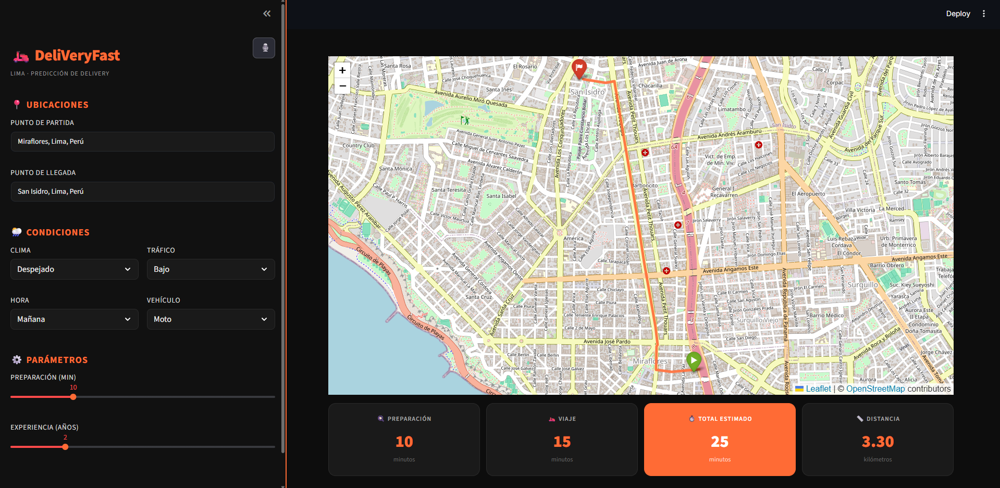

# 🛵 DeliVeryFast

Sistema inteligente de predicción de tiempos de entrega en Lima mediante Machine Learning, con ruteo real sobre el mapa de la ciudad y control por voz.

## 📌 Descripción

DeliVeryFast es una aplicación web desarrollada con Streamlit que estima el tiempo de entrega de un pedido usando un **modelo de Machine Learning entrenado** (scikit-learn), considerando variables operativas reales:

- 📍 Origen y destino (con geocodificación)
- 🌦️ Condiciones climáticas
- 🚦 Nivel de tráfico
- 🕒 Hora del día
- 🛵 Tipo de vehículo
- 🍳 Tiempo de preparación
- 👤 Experiencia del repartidor

El resultado se visualiza sobre un **mapa interactivo de Lima** con la ruta real calculada sobre el grafo de calles de la ciudad.

## 🚀 Características

- **Predicción con Machine Learning**: modelo entrenado con scikit-learn, con encoders para variables categóricas (clima, tráfico, vehículo, hora)
- **Ruteo real**: cálculo de la ruta más corta sobre el grafo de calles de Lima con OSMnx + NetworkX
- **Mapa interactivo**: visualización con Folium, segmentos de ruta coloreados según condiciones
- **Entrada por voz**: dicta origen y destino, la app los interpreta y completa el formulario automáticamente
- **Comparación entre vehículos** (moto, scooter, bicicleta)
- **Interfaz moderna** con Streamlit

## 🛠 Stack técnico

- **Lenguaje**: Python
- **ML**: scikit-learn, joblib (modelo + encoders serializados)
- **Datos**: Pandas, NumPy
- **Ruteo/Geo**: OSMnx, NetworkX, Geopy (geocodificación)
- **Visualización**: Streamlit, Folium

## 📂 Estructura del proyecto

```
DeliVeryFast/
├── DeliVeryFast.ipynb        # Entrenamiento y comparación de modelos
├── app.py                    # Aplicación Streamlit
├── modelo_final.pkl          # Modelo entrenado
├── le_time.pkl                # Encoder: hora
├── le_traffic.pkl             # Encoder: tráfico
├── le_vehicle.pkl              # Encoder: vehículo
├── le_weather.pkl             # Encoder: clima
├── dataset_enriquecido.csv    # Dataset usado para entrenamiento
├── requirements.txt
└── README.md
```

## 📸 Capturas de pantalla

### Programa en ejecución


## ⚙️ Instalación

Clonar el repositorio
```bash
git clone https://github.com/Juandi1602/DeliVeryFast.git
cd DeliVeryFast
```

Instalar dependencias
```bash
pip install -r requirements.txt
```

Ejecutar
```bash
streamlit run app.py
```

## 📊 Modelo de Machine Learning

El modelo fue entrenado en Google Colab con un dataset de **45,584 registros** de entregas urbanas (Zomato Delivery Operations Analytics), usando distancias reales calculadas con Haversine. Se compararon varios algoritmos (Regresión Lineal, Ridge, Random Forest, LightGBM, Stacking), obteniendo el mejor resultado con un modelo de 8 features (R² ≈ 0.51).

Durante la predicción en la app se aplican las mismas transformaciones (encoders) usadas en el entrenamiento antes de generar la estimación final.

## 💡 Contexto del proyecto

DeliVeryFast nace de la necesidad de estimar tiempos de entrega de forma realista en una ciudad con tráfico y condiciones muy variables como Lima, combinando un modelo predictivo entrenado con datos reales y el ruteo real sobre el mapa de la ciudad — no solo una fórmula fija.

## 👤 Autor

**Juan Diego Constantino** — Estudiante de Ingeniería de Sistemas, UPN
[GitHub](https://github.com/Juandi1602) | [LinkedIn](https://www.linkedin.com/in/juan-diego-constantino-8571b5344/)
